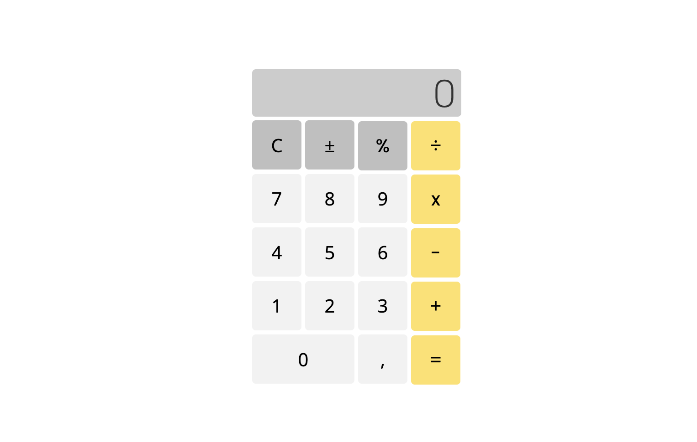

# Calculator 

This project is a part of the [Odin](https://www.theodinproject.com) curriculum on programming. This is a final practical [task](https://www.theodinproject.com/lessons/foundations-calculator) that implements all the basic JavaScript concepts learned in the course. 

The calculator includes all the standard functions: addition, subtraction, multiplication, division, calculation interest, flipping the sign and a decimal button.

Live preview can be found [here](https://mountainflockscalculator.netlify.app).

## Technologies used: 

 * HTML
 * CSS
 * JavaScript

 ## Display
 